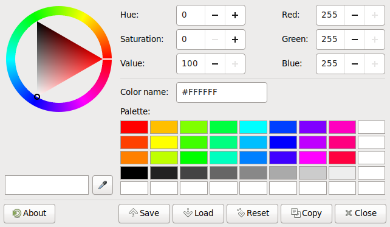

mate-color-select
=================

included in _mate-desktop_


  
**MATE Color Selection** with indelible swatches

- Palette default is *Hue* 15° * 3\*8 = 360°

- *Saturation* 100%, *Value* 100%

- Grayscale line

- Default color

- Extra swatches for alterations

- All swatches are read/write

- Marked are indelible

- Keyboard support

- Runs under X11

----------------

Compile:
--------

```
# autotools
./autogen.sh --disable-nls --disable-introspection && make

# meson
meson setup MY
meson compile -C MY
```

Run w/o install & sudo:
-----------------------

```
f="org.mate.applications-colors.gschema.xml"
d="$PWD/schemas/glib-2.0/schemas"
mkdir -p $d
ln -s ../../$f $d/$f
glib-compile-schemas $d

env XDG_DATA_DIRS=$XDG_DATA_DIRS:schemas tools/mate-color-select

env XDG_DATA_DIRS=$XDG_DATA_DIRS:schemas MY/tools/mate-color-select
```

-------------------------------------------------------------------

Run w/o install:
----------------

```
d="/usr/local/share/glib-2.0/schemas"
sudo mkdir -p $d
sudo cp schemas/org.mate.applications-colors.gschema.xml $d
sudo glib-compile-schemas $d

tools/mate-color-select

MY/tools/mate-color-select
```

--------------------------

Install:
--------

```
# autotools
sudo make install

# meson
sudo meson install -C MY

# both
sudo ldconfig
hash mate-color-select
```

Run:
----

```
mate-color-select
```

Uninstall:
----------

```
# autotools
sudo make uninstall

# meson
sudo ninja -C MY uninstall
sudo rm /usr/local/share/glib-2.0/schemas/gschemas.compiled
```

--------------------------

Hint:
-----

for problems with meson use `sudo`

